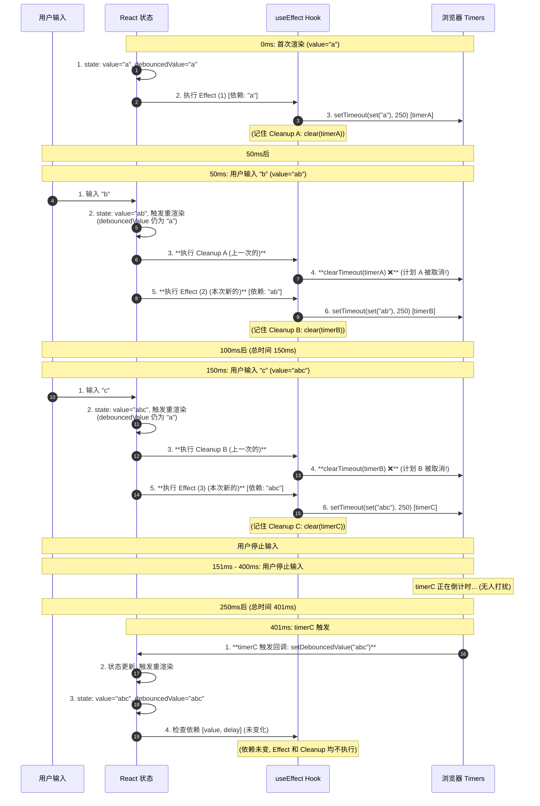
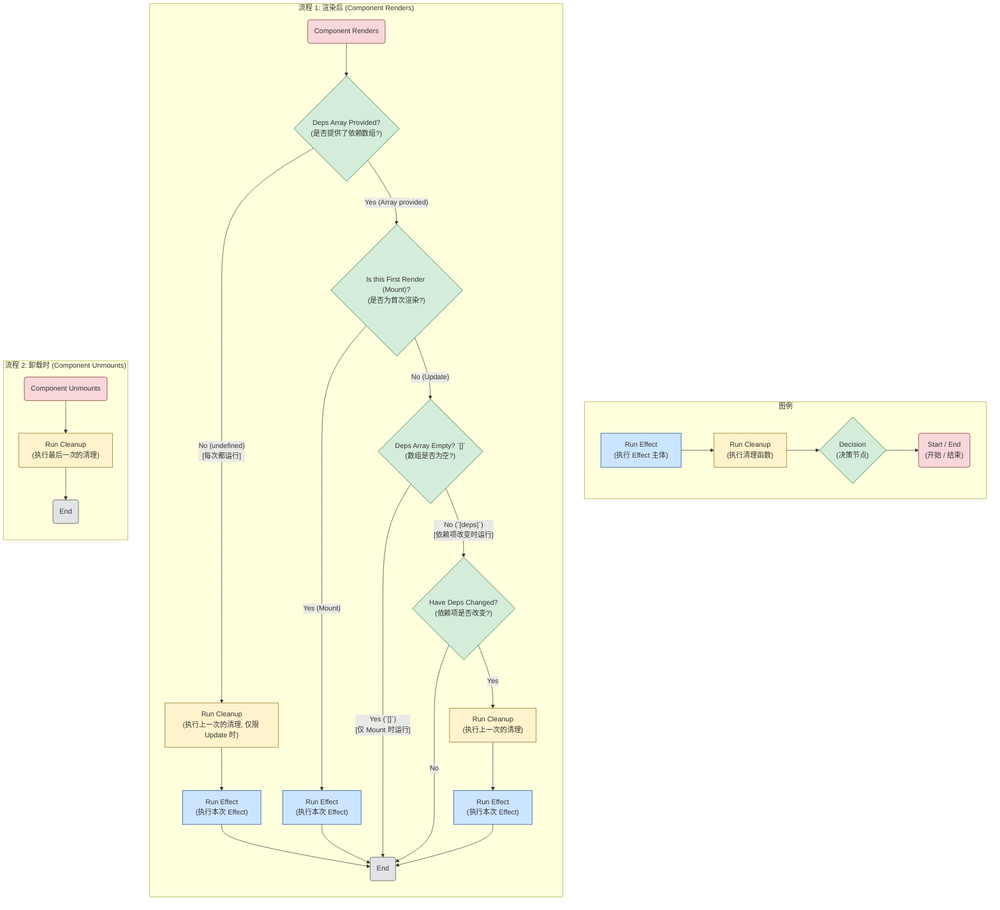

# User Directory

A small Next.js app that fetches a list of users, supports search and nationality filtering, and lets you favorite users with localStorage persistence.

Key choices for stability:

- `randomuser.me` requests use a fixed `seed` (`seed=user-directory`) for deterministic data.
- `User.id` uses `login.uuid` from the API for a stable unique identifier.
- React Query is tuned for fewer surprise refetches: `staleTime: 30 * 60 * 1000`, and both `refetchOnWindowFocus` and `refetchOnReconnect` are disabled.

## Tech Stack

- Next.js App Router (TypeScript, Tailwind)
- React 19
- @tanstack/react-query v5

## Getting Started

Install dependencies and start the dev server:

```bash
npm install
npm run dev
```

Open http://localhost:3000 to view the app.

## Scripts

- `npm run dev` – start dev server
- `npm run build` – production build
- `npm start` – start production server
- `npm run lint` – run ESLint

## Project Structure

- `app/` – App Router entry, providers, layout
- `components/` – UI components (`UserDirectory`, `UserCard`)
- `hooks/` – `useUsers`, `useUserSearch`, `useFavorites`
- `lib/` – API fetch and mapping
- `types/` – shared TypeScript types
- `docs/` – tutorials and known issues

## Favorites & Data Consistency

- Favorites are persisted in `localStorage` (client-only) as a list of user IDs.
- The favorites badge and tab compute the intersection of stored IDs and the currently loaded users to avoid mismatches when the dataset changes.
- See Known Issues for context and alternatives.

## Documentation

- Tutorials overview: `docs/tutorials/README.md`
- Known issue write-up: `docs/known-issues/favorites-data-mismatch.md`

## Notes

- This repo favors clarity and speed for interview-style builds; production-hardening (validation, retries, accessibility) is outlined in the tutorial’s “Next steps”.

---




